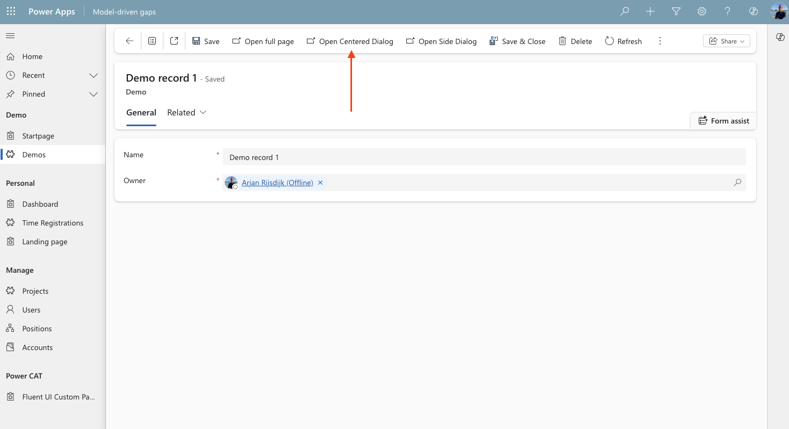

# From Custom to Generative

## Filling Model-Driven gaps with pages ##

### We need to build a solution ...

What do we need? A Model-driven app or a Canvas app 🤔

### The differences

Let's take look at the differences 👀

| Model-driven apps | Canvas apps |
| -------- | ------- |
| ✅ Data-first approach | ✅ Design-first approach |
| ✅ Automatic UI generation | ✅ Multiple data sources |
| ✅ Built-in business logic | ✅ Highly customizable UI |
| ✅ Responsive design | ✅ Requires more design effort |

### Wait a minute ...

Do we really have to choose? 🤔

We don’t ...

There is another option 😌

### Custom pages

What are custom pages?

➡️ Model-driven app component

➡️ Integrated Canvas app

➡️ 99% of Canvas capabilities

➡️ In or outside your model-driven app navigation

➡️ Adds flexibility

### Create a custom page

Create from solution

### Create a custom page

Create from Power Apps Studio

### The result

Just a simple Canvas page

## Just a page?

### 
It's more then just a page ...

### Display custom pages

There are multiple ways to display and use custom pages

➡️ Full page

➡️ Centered dialog

➡️ Side dialog

➡️ Inline side dialog

### Full page

### Centered dialog

### Side dialog

### Inline side panes

### Trigger the page

Trigger a custom page to open

➡️ From the navigation

➡️ From a view or form

➡️ From a selected item

### Trigger from the navigation

### Trigger from a view or selected item

### Trigger from a form

### Getting context

Get context of a selected item

### Step by step

To open a custom page as a dialog with context, follow these steps

1️⃣ Create a custom page

2️⃣ Add a custom command in your commandbar

3️⃣ Add (a little bit of) JavaScript

4️⃣ Enter a few parameters

5️⃣ Get the selected recordId in your custom page 

### Step 1 - Create a custom page

First, create a new custom page

### Step 2 - Add a custom command

Open the custom page from a form, so add a custom command

### Step 3 - Add JavaScript (1)

Now we need a little bit of JavaScript to trigger the custom page and define its position

### Step 3 - Add JavaScript (2)

Let’s dive into the JavaScript

[link to file]

### Step 4 - Enter a few parameters

### Step 5 - Get the selected recordId

Using Param() in the App OnStart property

### The result

# Examples

Let's take a look at some examples

### Output management (1)

### Output management (2)

### Review app

### UI Creator (1)

### UI Creator (2)

### Timesheet dashboard

# User interface

### Let's keep things consistent 😃

### Consistency

✅ A consistent UI is very important

✅ Model-driven apps are not very flexible when it comes to the UI

✅ Style custom pages like your model-driven app

✅ Keep it responsive

### Consistency

Use the same ...

✅ Colorpalette

✅ Fonts and font sizes

✅ Structure

### There's help

No need to figure everything out on our own ...

# Creator kit

## By the Power CAT team

### What is the Creator Kit?

✅ Reference apps (Canvas and Model-Driven) for hands-on learning and seeing components in action

✅ Starter templates: canvas app templates + custom page templates for model-driven apps

✅ Component library with reusable UI components

✅ Code components (PCF) for more advanced reusable controls

✅ Fluent Theme / Theme Editor

### How to get it?

# One more thing ...

## There is a new kid on the block ...

### Generative pages 

✅ AI-driven experience inside model-driven apps

✅ Interactive AI agent

✅ Describe your page in natural language

✅ Build pages simpler, faster and smarter

✅ React code component (editable)

🧐 **Preview**

### Get started

What do we need?

➡️ Preview environment

➡️ Turn on code components (environment setting)

➡️ Model-driven app

